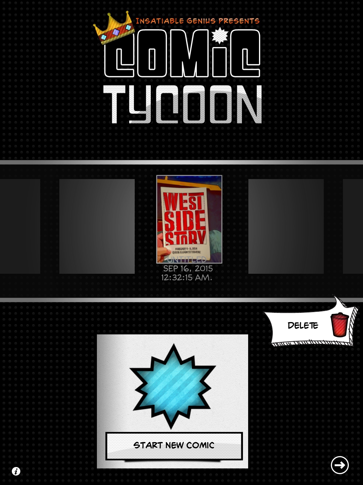
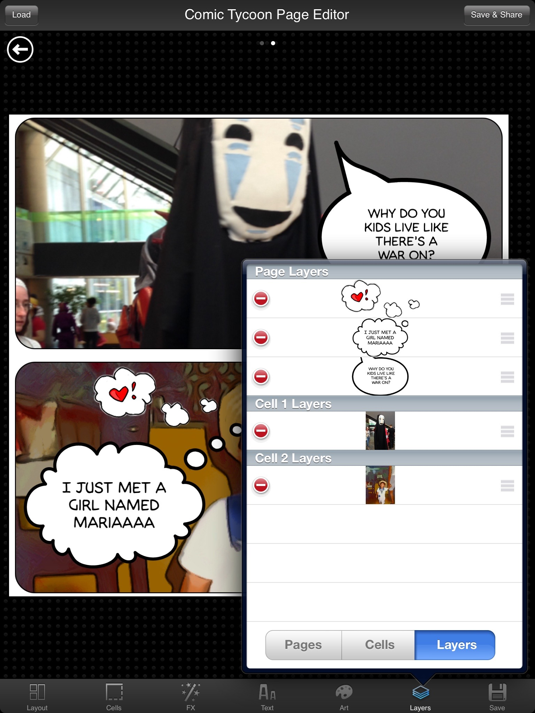
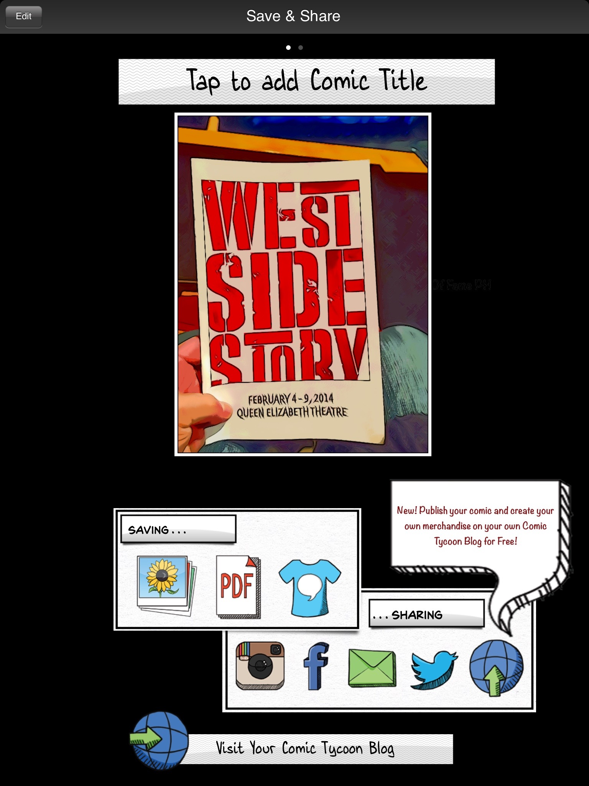

# Comic Tycoon
### Objective-C, Building for Multiple Screen Sizes, App Store Submissions

**What**: Comic Tycoon is a mobile app for iOS devices where users can create comics from their images. This app was developed using Objective-C, and users can run their images through an engine to turn them into cartoons and organize them into a comic-like format, with many options for panels, headings, and speech bubbles. Users may also share their creations through various social media websites, not the least of which was Comic Galaxy, a website created by the same group (Insatiable Genius).    
**Who**: Comic Tycoon was developed under Insatiable Genius.    
**When**: Work began around Fall 2012, and was released Summer 2013. 

  

**Where**: Screenshots in this repository. The app on the Apple [app store](https://itunes.apple.com/ca/app/comic-tycoon-hd/id609065885?mt=8).

---  

**My Role**: The app was primarily developed by myself and another programmer. I worked primarily on developing the interface we sketched out, arranging the views and implementing the comic features (i.e. giving the user a large amount of control on the panels, the speech bubbles, auto-adjusting the page for headers, creating the layers system, etc.)

**What I learned**: The app development process, from conception to design to building to localization to release.
