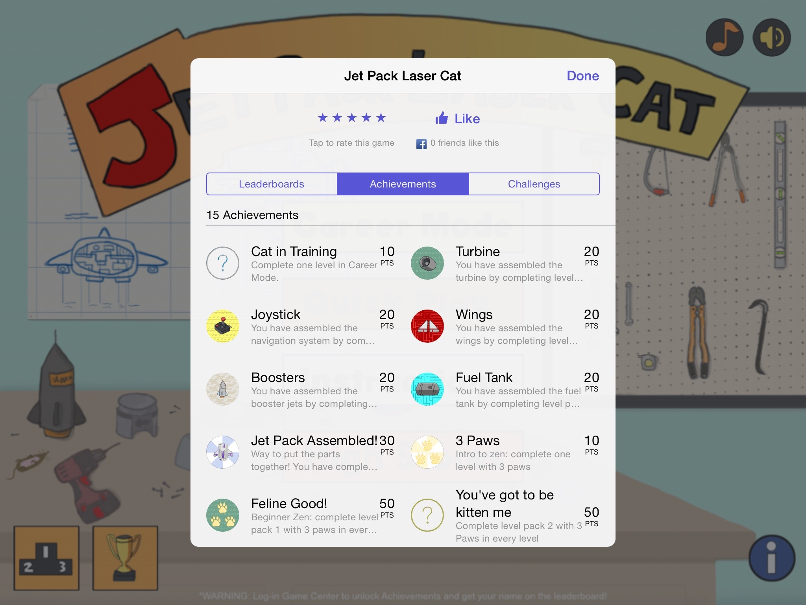

#Jet Pack Laser Cat
### Objective-C, Cocos2D, GameKit

What: Jet Pack Laser Cat is an iPad game where the player uses touch controls to lead the protagonist - the titular cat - towards tools to build a jetpack to escape. Developed using Objective-C and the Cocos2D library, JPLC tests dexterity and patience, making players guide the cat around borders and obstacles to victory. Beyond a campaign mode, the game also boasts a Nine Lives mode where users can test their skills against a time limit.    
Who: JPLC was developed in a team of 3 people.    
When: The app was developed over 3 months in Summer 2011.    
Where: Screenshots in this repository. Code on GitHub. The game on the iPad App Store.

  

---  

My Role: I was the developer of the game, which had been mostly designed by my teammates before I jumped on board. I developed the code base, delegating only a few coding tasks to another teammate after designing the code such that they could make levels by plugging in graphics and changing only a few lines of code. I demoed and discussed often with both teammates to ensure that level design was tight and fun, and worked with them to test the game by recruiting people and designing a questionnaire for testers to answer.    

What I learned: Self-teaching myself a new language and library fast. I was pretty proud of this project because I felt I picked it up pretty quickly and was able to produce an app from scratch in a team of 3 in 3 months. As well, after a misguided approach, I reinforced the DRY principle, coding levels in such a way that code was not repeated and levels could easily be plugged in by novices after some instruction. Learning some gave development skills, such as working with the collision engine and sprite sheets, were nice bonuses.
