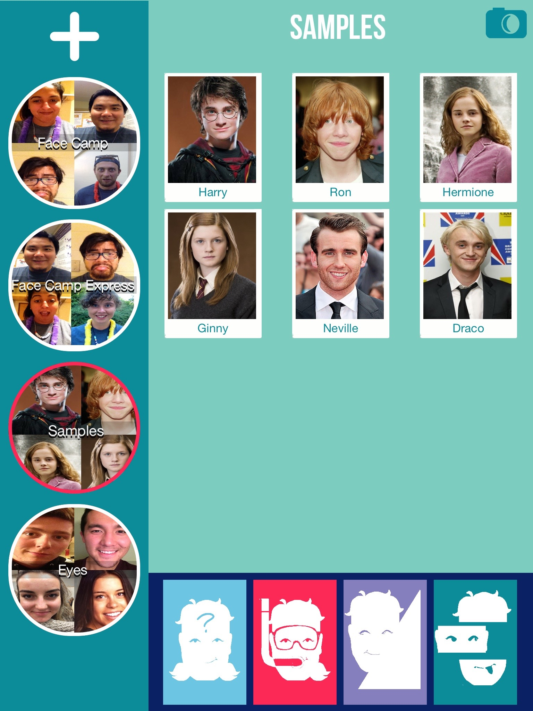

# LFI 2.0
### Objective-C, Core Data, MVC, SpriteKit, Swift

**What**: Let's Face It 2.0 is an iPad app being developed at the Centre of Autism Research, Technology, and Education    ([Site](http://web.uvic.ca/~carte/) | [Facebook](https://www.facebook.com/CARTEUVIC/?ref=aymt_homepage_panel)) at the University of Victoria. The aim of the app is to enhance the socio-emotional skills of children with ASD, taking inspiration from the original Let's Face It! program ([Link](http://web.uvic.ca/~letsface/letsfaceit/)) and extending it by making the content children play with more personal.    
**Who**: I'm part of the tech team at CARTE, working with a team of student developers (that's changed a lot over the years!). I've led the team working on this project since 2015.  
**When**: The app has gone through a number of iterations and beta tests since 2012, and we expect to release by the start of 2016.   
**Where**: Screenshots in this repository. Video, code samples to come. The project, is sitting in a private repository.   

---

**My Role**: From the beginning, I was involved in most aspects of the app, including coding up the main user interface (which has changed many times since the program's inception), working on the content creation module (i.e. working with the iOS camera), working with Core Data for the content models, and working with Instruments to eliminate memory leaks and issues introduced. More recently, I've worked as a lead of sorts to delegate tasks and help volunteers and others in the group to learn the development process.    
**What I learned**: More about the app development process, including technologies that I had not worked with before, such as Core Data and SpriteKit. I've also learned a lot about leading a team and the fun and challenges that come with it, particularly that which comes with requirements that change regularly from testing with the target population.
