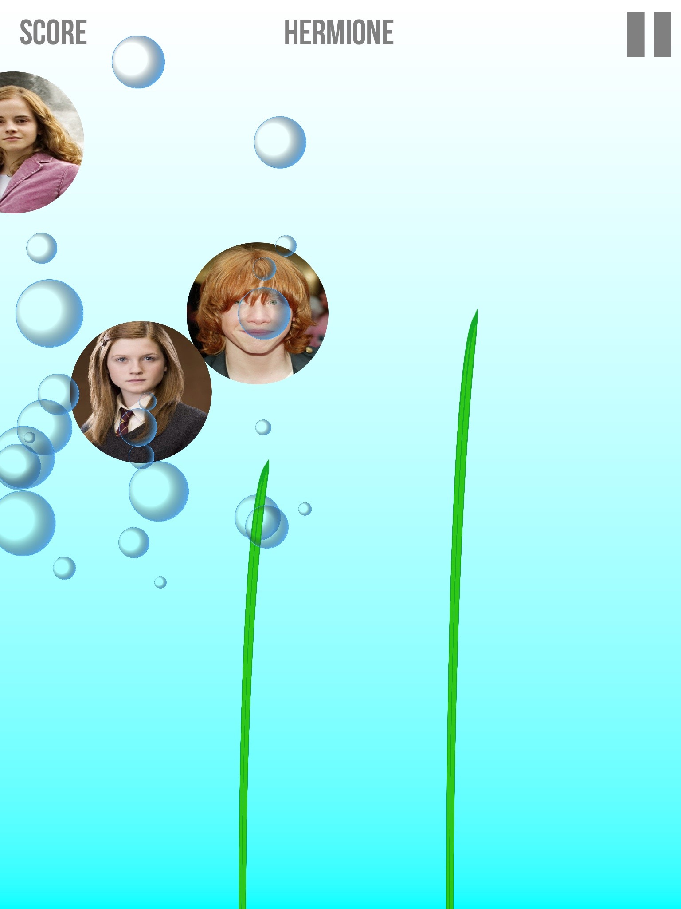

# LFI 2.0

**What**: Let's Face It 2.0 is an iPad app being developed at the Centre of Autism Research, Technology, and Education    ([Site](http://web.uvic.ca/~carte/) | [Facebook](https://www.facebook.com/CARTEUVIC/?ref=aymt_homepage_panel)) at the University of Victoria. The aim of the app is to enhance the socio-emotional skills of children with ASD, taking inspiration from the original Let's Face It! program ([Link](http://web.uvic.ca/~letsface/letsfaceit/)) and extending it by making the content children play with more personal.   
**Who**: I'm part of the tech team at CARTE, working with a team of student developers (that's changed a lot over the years!).  
**When**: The app has gone through a number of iterations and beta tests since 2012, and we expect to release by the start of 2016.   
**Where**: Screenshots in this repository. Video, code samples to come.   

---

**My Role**:     
**What I learned**:
