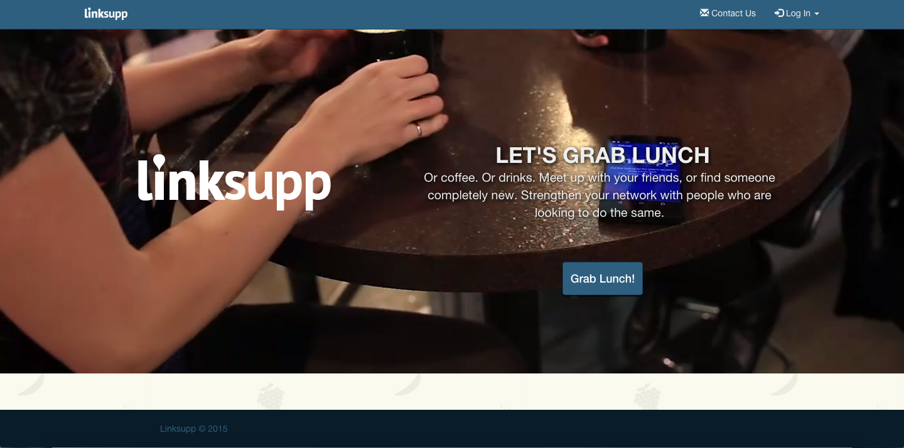
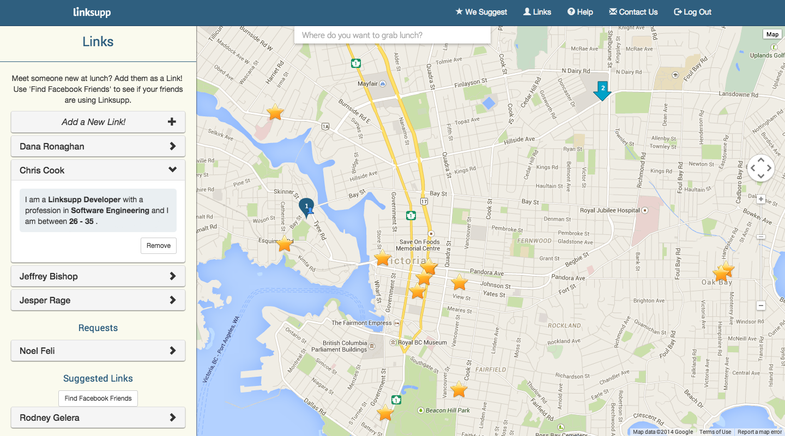
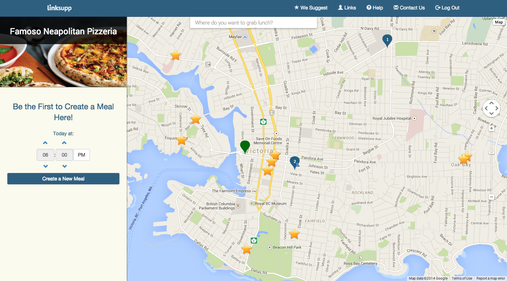

# Linksupp
### AngularJS, MEAN, NoSQL, Presentations, Group Project, AWS

**What**: Linksupp is a web application built on the MEAN Stack (MongoDB, ExpressJS, AngularJS, NodeJS) and previously hosted on AWS. The application is aimed for business savvy, outgoing groups of people who are looking for opportunities to meet new contacts, and expand their friend base by meeting people informally for a meal.     

**Who**: This project was created in a group of 5 student developers.   
**When**: Linksupp began as a class project for a course named "Startup Programming", spanning 4 months in Fall 2014. At the moment, 3 of the developers (including myself) are reworking Linksupp using other technologies, such as Django, Foundation, and Grunt.    
**Where**: Screenshots in this repository. A video of our final product for the class presentation in YouTube. The project, including my contributions, are on GitHub. We took down the live website due to running costs.    

---

**My Role**: I primarily worked on the backend, using MongoDB and NoSQL to design and implement our database and how the front-end interacts with it. However, I was also involved with many aspects of the front-end, either through assisting the other developers, fixing bugs, or implementing features such as using Socket.io to watch the database in real-time and reflecting the changes on the front end.     
**What I learned**: Three primary learning outcomes came from this project: pair programming, meeting deadlines, and how to present our progress. The project involved a lot of pair programming work, which allowed me to gain some experience in working closely with another developer to combine our knowledge and keep each other in check for producing good code. As well, the course was designed so that there were three deadlines, once every month - an end-to-end demo, a release candidate, and a live beta. As the course went on, our group became better and planning out our sprints and identifying which goals were achievable, and the late night work decreased as we gained more experience. On these deadlines, we were required to present our progress to a panel of experts, which allowed me to hone my presentation and Q&A skills and learn how to emphasize certain points and to have a backup plan.
